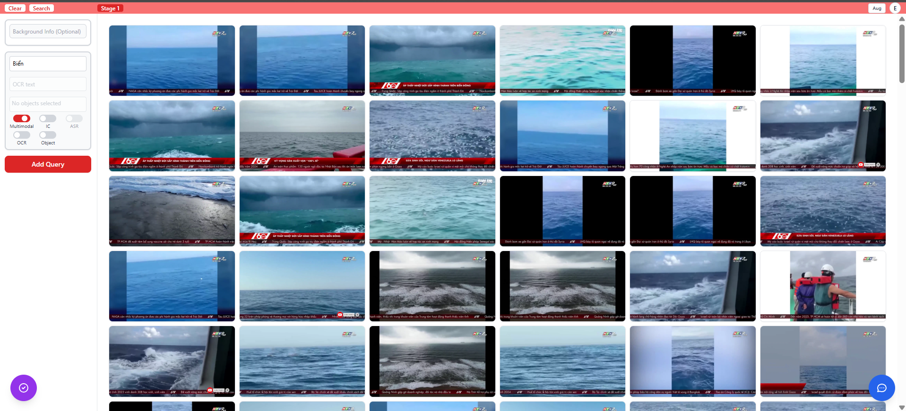
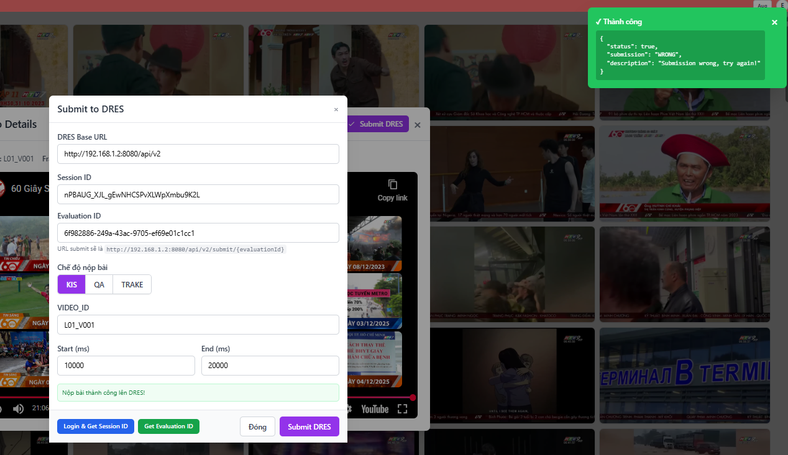

# AI Video Retrieval System

An intelligent video retrieval system optimized for competition environments, combining Vector Search (semantic/multimodal) and Text Search (ASR/OCR) with score normalization and ensemble ranking for Top-K results.

<!-- TODO: Insert search interface screenshot here -->



## 📋 Table of Contents

- [System Overview](#system-overview)
- [Architecture](#architecture)
- [Search Pipeline](#search-pipeline)
- [Search Methods](#search-methods)
- [Query Augmentation](#query-augmentation)
- [Ensemble & Normalization](#ensemble--normalization)
- [Advanced Features](#advanced-features)
- [Chatbox & DRES](#chatbox--dres)
- [Getting Started](#getting-started)
- [Tech Stack](#tech-stack)

---

## 🎯 System Overview

1. **Video retrieval by user query** — Optimized specifically for competitive environments, ensuring high speed and accuracy.

2. **Multimodal fusion** — Integrates Vector Search (semantic/multimodal) + Text Search (ASR/OCR), followed by score normalization and ensemble for Top-K ranking.

3. **Team collaboration & submission** — Built-in Chatbox for teamwork and DRES (KIS) submission integration.

---

## 🏗️ Architecture

The system is built on a clear 3-tier architecture:

### Frontend (UI) — React + Vite

The user interface allows:

- **Query input** (Vietnamese/English) and search strategy configuration:
  - Toggle search branches (Multimodal / IC / ASR / OCR)
  - Multi-stage search configuration
  - Temporal aggregation modes (ID mode / Tuple mode)
  - Object filtering

- **Result display**:
  - Top-K results by keyframe/video
  - Save answers to Chatbox
  - Submit answers via DRES

### Backend Orchestrator — FastAPI

End-to-end search pipeline orchestration:

1. **Preprocessing**: Query translation (VN → EN when needed)
2. **Query Augmentation**: Uses Gemini to generate Q0, Q1, Q2
3. **Embedding Extraction**: Calls Embedding Services (CLIP/BEiT-3/BIGG/Qwen) via NGROK
4. **Parallel Search**:
   - Vector Search (Qdrant): CLIP, BEiT-3, BIGG, IC
   - Text Search (Elasticsearch): ASR, OCR
5. **Score Normalization & Ensemble**: Multi-level score normalization and combination
6. **Multi-Stage Processing** (optional): Multiple independent search stages
7. **Temporal Aggregation** (optional): Time-based result aggregation
8. **Object Filtering** (optional): Filter by detected objects
9. **Final Ranking**: ID → keyframe path + timestamp (FPS) mapping → Top-K

**Integrations**:
- Chatbox/Collab (PostgreSQL): Store and share answers
- DRES submit: Auto-fill from mapping + FPS data

### Data & Infrastructure Layer

- **Qdrant (Vector DB)**:
  - Collections: `clip`, `beit3`, `bigg_clip`, `ic`
  - Stores embeddings for vector search

- **Elasticsearch (Text Search)**:
  - Indices: `asr` (audio transcript), `ocr` (in-video text), `object` (object detection)
  - BM25 search support

- **PostgreSQL**:
  - Chatbox/collab: Stores answers, queries, and related keyframes/videos

---

## 🔄 Search Pipeline

### Runtime Search Pipeline

```
User Query (VN/EN)
    ↓
[1] Query Preprocessing
    - Translation (VN → EN when needed)
    - Query Augmentation (Gemini): Q0, Q1, Q2
    - Method Selection
    ↓
[2] Parallel Embedding Extraction
    - CLIP/BEiT-3/BIGG/Qwen → NGROK Servers
    ↓
[3] Parallel Search
    - Vector Search (Qdrant): CLIP, BEiT-3, BIGG, IC
    - Text Search (Elasticsearch): ASR, OCR
    ↓
[4] Score Normalization & Ensemble
    - Z-score (multimodal), Min-Max (IC), BM25 (ASR/OCR)
    - Weighted ensemble (CLIP:0.25, BEiT3:0.50, BIGG:0.25)
    ↓
[5] Multi-Stage Processing (optional)
    - Stage 1, 2, ... N (each stage has Q0, Q1, Q2)
    - Temporal Aggregation (ID mode / Tuple mode)
    ↓
[6] Object Filtering (optional)
    - Elasticsearch filter by selected objects
    ↓
[7] Final Ranking
    - Sort by score → ID → Keyframe Path mapping
    - Return Top-K results
```

### Offline Data Preparation

#### Phase 1: Data Preprocessing (Kaggle)

- **Scene Extraction → Keyframes**: AutoShot for scene detection and keyframe extraction
- **Embedding Extraction**:
  - Multimodal: CLIP, BEiT-3, BIGG → FAISS .bin files
  - IC: BLIP-2 (caption) + Qwen3 (embedding) → IC.bin + IC.json
  - OCR: Gemini 2.5 Flash → NDJSON format
  - ASR: Speech-to-text → Elasticsearch index
  - Object: Object detection → Elasticsearch index
- **Output Files**:
  - `.bin` files: clip.bin, beit3.bin, bigg_clip.bin, IC.bin
  - JSON files: mapping_kf.json, mapping_scene.json, fps_mapping.json, IC.json
  - Elasticsearch indices: asr, ocr, object

#### Phase 2: Deployment (NGROK + Vector DB)

- **Embedding Services (Kaggle → Internet via NGROK)**:
  - Embedding servers: CLIP, BEiT-3, BIGG, Qwen running on Kaggle
  - NGROK creates public endpoints with load balancing:
    - `EMBEDDING_SERVER_MULTIMODAL`
    - `EMBEDDING_SERVER_QWEN`

- **Vector Database Ingestion**:
  - Load FAISS .bin files → Upload to Qdrant collections
  - Batch processing: 50 vectors/batch (memory-efficient)

---

## 🔍 Search Methods

The system integrates 4 main search methods:

### 1. Multimodal Vector Search (Qdrant)

- **3-model ensemble**: CLIP (0.25) + BEiT-3 (0.50) + BIGG (0.25)
- Leverages each model's strengths for multimodal content understanding
- Vector search across Qdrant collections: `clip`, `beit3`, `bigg_clip`

### 2. IC Search (Caption-based)

- **Offline**: BLIP-2 generates captions → Qwen embedding
- **Runtime**: Vector search on Qdrant `ic` collection + optional Cohere reranking
- Searches based on keyframe content descriptions

### 3. ASR Search (Text)

- **Elasticsearch BM25** on audio transcripts
- Supports direct Vietnamese text search
- Index: `asr`

### 4. OCR Search (Text)

- **Elasticsearch BM25** on OCR/subtitles/in-frame text
- Finds text appearing in video frames
- Index: `ocr`

---

## 🚀 Query Augmentation

The system uses **Gemini 2.0 Flash Lite** to automatically generate query variants, improving recall and Top-K stability:

- **Q0**: Original query (or translated VN→EN when needed)
- **Q1, Q2**: Gemini generates 2 semantically equivalent variants

**Safe fallback**: On error/timeout/parse failure → Q0 is reused for Q1/Q2.

This increases the likelihood of finding relevant results even with different phrasings, thereby improving overall system recall.

---

## 📊 Ensemble & Normalization

The system performs ensemble and score normalization at 3 levels:

### Level 1 — Within Multimodal (per Qi)

- **CLIP/BEiT-3/BIGG**:
  - Z-score normalization
  - Weighted sum (0.25 / 0.50 / 0.25)
  - Min-Max scaling

### Level 2 — Cross-Methods (per Qi)

- Combines **Multimodal + IC + ASR + OCR** (enabled branches)
- **Per-branch scaling**:
  - IC: Min-Max
  - ASR/OCR (BM25): Z-score → Sigmoid
- **Ensemble**: Weighted average (equal by default)

### Level 3 — Cross-Queries

- Merges **Q0/Q1/Q2** → **Q3** by averaging
- Re-ranks for final Top-K

---

## ⚡ Advanced Features

### Multi-Stage Search

Enables multiple independent search stages, each with:
- Its own query
- Its own search methods
- Its own filter conditions

All stages are processed **in parallel** for optimal latency.

### Temporal Aggregation

Two temporal aggregation modes are supported:

- **ID mode**: Groups results by video and sums scores to find videos with the most matching keyframes
- **Tuple mode**: Finds consecutive keyframes in ascending order within the same video, suitable for queries requiring continuous video segments

### Object Filtering

- Filters results by detected objects (person, car, dog, etc.)
- Uses Elasticsearch `object` index

---

## 💬 Chatbox & DRES

### Chatbox (PostgreSQL)

Built-in Chatbox for team collaboration during competitions:

- When a matching video is found, team members can **save answers** with the query and keyframe to the database
- Other members can **review** all saved answers
- **Filter** by query or submitter
- Helps the team share and reference found answers, avoiding duplicates

### DRES Integration

Integrated with **DRES** (competition evaluation system) for official answer submission:

- After logging in and selecting an evaluation, users can submit answers in 3 modes:
  - **KIS**: Submit a video segment with start and end timestamps
  - **QA**: Submit an answer with video and timestamp
  - **TRAKE**: Submit multiple frame IDs within the same video

- **Auto-fill**: Automatically populates information from the selected keyframe path, converting frame indices to timestamps via FPS

<!-- TODO: Insert DRES submission interface screenshot here -->


---

## 🚀 Getting Started

### Prerequisites

- Python 3.12+
- Node.js 18+
- Docker & Docker Compose
- Qdrant running on port 6333
- Elasticsearch running on port 9200

### Backend Setup

```bash
cd backend

# Create virtual environment
python -m venv .venv
source .venv/bin/activate  # Windows: .venv\Scripts\Activate.ps1

# Install dependencies
pip install -e .

# Create .env file
cp env.example .env
# Edit .env with your API keys (Gemini, NGROK endpoints, etc.)

# Run backend
uvicorn app.main:app --host 0.0.0.0 --port 8000 --reload
```

### Frontend Setup

```bash
cd frontend

# Install dependencies
npm install

# Run dev server
npm run dev
```

### Docker Compose (Full Stack)

```bash
# Start all services
docker-compose up -d

# Frontend: http://localhost:3000
# Backend: http://localhost:8000
# Qdrant: http://localhost:6333
# Elasticsearch: http://localhost:9200
```

### Embedding Server Configuration

Ensure embedding servers are running on Kaggle and exposed via NGROK:

```env
EMBEDDING_SERVER_MULTIMODAL=<ngrok_server_url>
EMBEDDING_SERVER_QWEN=<ngrok_server_url>
```

---

## 🛠️ Tech Stack

### Frontend
- **React 18.2** + **Vite 5.4**: User interface
- **TailwindCSS**: Styling
- **Context API**: State management

### Backend
- **FastAPI 0.104**: REST API server
- **Python 3.12**: Backend language
- **Pydantic**: Data validation
- **ThreadPoolExecutor**: Parallel processing (20 workers)

### Infrastructure
- **Qdrant 1.7**: Vector database
- **Elasticsearch 8.x**: Text search engine
- **PostgreSQL**: Chatbox database
- **NGROK**: Tunneling from Kaggle to the internet

### AI Models & Services
- **CLIP**: Multimodal embedding
- **BEiT-3**: Multimodal embedding
- **BIGG**: Multimodal embedding
- **Qwen3**: Text embedding (IC search)
- **BLIP-2**: Image captioning
- **Gemini 2.0 Flash Lite**: Query augmentation
- **Gemini 2.5 Flash**: OCR extraction
- **Cohere**: Reranking (IC search)

---

## 📈 Competition Design

The system is designed to meet the demanding requirements of competitive environments:

### Speed
- Multi-level parallelism (query variants, search methods, stages)
- ThreadPoolExecutor with 20 workers
- NGROK with load balancing
- Fast response times even under concurrent user load

### Accuracy
- Query augmentation improves recall
- Ensemble combines strengths of multiple methods
- Cohere reranking
- Temporal aggregation for continuous video segments

### Flexibility
- Adjustable strategy per stage
- Toggle methods on/off as needed
- Object filtering
- Choose the appropriate temporal aggregation mode

### Collaboration
- Chatbox for sharing answers
- DRES integration for submission
- Auto-fill saves time

---

## 📄 License

CS336 - Information Retrieval Project

## 👥 Contributors

- Team CS336
- AI Video Retrieval System
